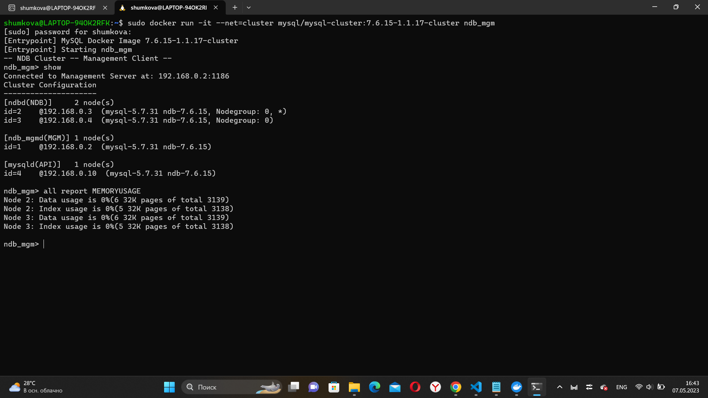

Кластер NDB

-- скачаем образ в локальный реджистри

sudo docker pull mysql/mysql-cluster:7.6.15-1.1.17-cluster

-- создадим сеть

sudo docker network create cluster --subnet=192.168.0.0/16

-- создадим управляющую ноду

sudo docker run -d --net=cluster --name=management1 --ip=192.168.0.2 mysql/mysql-cluster:7.6.15-1.1.17-cluster ndb_mgmd

-- создадим две дата ноды

sudo docker run -d --net=cluster --name=ndb1 --ip=192.168.0.3 mysql/mysql-cluster:7.6.15-1.1.17-cluster ndbd

sudo docker run -d --net=cluster --name=ndb2 --ip=192.168.0.4 mysql/mysql-cluster:7.6.15-1.1.17-cluster ndbd

-- создадим серверную SQL ноду

sudo docker run -d --net=cluster --name=mysql1 --ip=192.168.0.10 -e MYSQL_RANDOM_ROOT_PASSWORD=true mysql/mysql-cluster:7.6.15-1.1.17-cluster mysqld

-- посмотрим список контейнеров и обратив внимание на разницу между ними

sudo docker ps

-- подключение к кластеру
-- найдем временный пароль

sudo docker logs mysql1 2>&1 | grep PASSWORD

 0DUKEvUf^oj-AkEc0sVUJLoz0bUg

-- подключимся клиентом изнутри контейнера mysql1

sudo docker exec -it mysql1 mysql -uroot -p0DUKEvUf^oj-AkEc0sVUJLoz0bUg

-- заменим пароль

ALTER USER 'root'@'localhost' IDENTIFIED BY 'my_sql';

SHOW databases;

USE ndbinfo;

SELECT * FROM nodes;

-- увидим уже собранный кластер !!!

-- запустим управляющий шелл 2 окно

sudo docker run -it --net=cluster mysql/mysql-cluster:7.6.15-1.1.17-cluster ndb_mgm

show    //просмотр ID нод

all report MEMORYUSAGE  //просмотр использование памяти

-- подключимся к SQL ноде - 3 окно

sudo docker exec -it mysql1 mysql -uroot -pmy_sql

CREATE database online_shop;  //создание БД "интернет-магазин"

SHOW DATABASES;         //просмотр баз данных

USE online_shop //использовать базу данных online_shop

Создаем необходимые таблицы...

SHOW tables;  //просмотр таблиц БД

---В 1 окне также есть БД online_shop

SHOW DATABASES;         //просмотр баз данных

USE online_shop

SHOW tables;

------Заливаем данные в таблицу

LOAD DATA INFILE '/var/lib/mysql-files/dump/some_customers.csv'
INTO TABLE customers
FIELDS TERMINATED BY ','
ENCLOSED BY '"'
LINES TERMINATED BY '\r'
IGNORE 1 ROWS
(title, first_name, last_name, correspondence_language, birth_date, gender, marital_status)
;

Ответ:

Query OK, 0 rows affected (0.01 sec)
Records: 0  Deleted: 0  Skipped: 0  Warnings: 0

Запрос выполнен, но записей нет...не знаю, что не так сделано.

